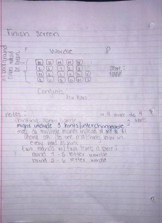
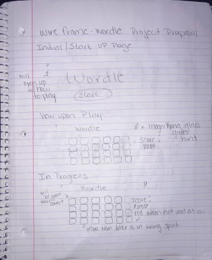

# project1-SanrioWordle
WireFrames

User Stories:
users: rated E for everyone; 
all users should be able to see if their guesses are correct, incorrect or in the wrong place in order to score on the gaem
all users should be able to read a how to guide in order to figure out how to play the game
As a player, I want to be able to access hints so that I can see where I am stuck at

Technologies used:
I used css, html, and js  
Installation Instructions:
Installing the game I started simple, I first started with my html and css mockup to get a basis, such as finding pictures to set as the background for each level

Unsolved problems/ Major hurdles:
My major hurdle was setting the grid layout and the animation; javascript was my main problem because its so many elements that goes behind the game, such as user input you have to not only think as a developer, but also as a player and see every step you need to include in order for the game to work out smoothly.
My unsolved problem was getting the grid to show up, i tried using css then realized js would be easier, I had a few problems going back and forth seeing how it worked

